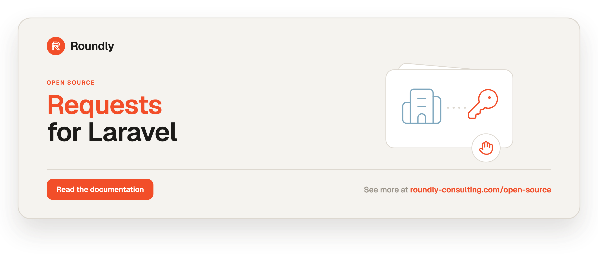

<!-- roundly-hero:start -->
<p align="center">
  <a href="https://roundly-consulting.com/open-source/docs/requests-for-laravel?utm_source=github&utm_medium=readme&utm_campaign=open-source&utm_content=requests-for-laravel">
    
  </a>
</p>
<!-- roundly-hero:end -->

<!-- roundly-badges:start -->
<p align="center">
  <a href="https://packagist.org/packages/roundly-consulting/requests-for-laravel"></a>
  <a href="https://github.com/roundly-consulting/requests-for-laravel/actions/workflows/run-tests.yml"></a>
  <a href="https://github.com/roundly-consulting/requests-for-laravel/actions/workflows/fix-php-code-style-issues.yml"></a>
  <a href="https://donate.stripe.com/dRmeVe8FX5PF1Qd9pXcEw00"></a>
  <a href="https://www.patreon.com/cw/roundly"></a>
  <a href="https://roundly-consulting.com/support-us?utm_source=github&utm_medium=readme&utm_campaign=open-source&utm_content=requests-for-laravel#crypto"></a>
</p>
<!-- roundly-badges:end -->

# Requests for Laravel

Requests from entities with approvals. This package models a **request** (a claim or
application) submitted by an entity that needs sign-off before it is resolved. The approval
flow runs on [`approvals-for-laravel`](https://github.com/roundly-consulting/approvals-for-laravel):
configurable rules (**unanimous / quorum / any / weighted**), **multi-stage pipelines**,
**named workflow presets**, **delegation**, per-decision reason + audit trail, and approval
expiry — while `requests` keeps its own `Status` lifecycle, events, and `Requests` facade.

## Requirements

- PHP `^8.4`
- Laravel `^12.0` or `^13.0`
- [`roundly-consulting/approvals-for-laravel`](https://github.com/roundly-consulting/approvals-for-laravel) (the approval engine)
- [`roundly-consulting/enums-for-laravel`](https://github.com/roundly-consulting/enums-for-laravel) (enum helpers on `Status`)

Both are hard dependencies and install automatically.

## Installation

```bash
composer require roundly-consulting/requests-for-laravel
```

Publish and run the migrations. The package does **not** auto-load them — publishing copies
the `requests` migration into your `database/migrations`, where you own it, so a bare
`php artisan migrate` before publishing creates nothing:

```bash
php artisan vendor:publish --tag="requests-migrations"
php artisan vendor:publish --tag="approvals-migrations"
php artisan migrate
```

Optionally publish the config files or translations:

```bash
php artisan vendor:publish --tag="requests-config"
php artisan vendor:publish --tag="approvals-config"
php artisan vendor:publish --tag="requests-translations"
```

`requests` owns the `requests` table; the `approvals`, `approval_requests`,
`approval_request_stages`, and `approval_delegations` tables are owned by the approvals
engine, so publish its migrations too.

## Configuration

`config/requests.php`:

```php
return [
    'model' => RoundlyConsulting\Requests\Models\Request::class,
    'key_type' => env('REQUESTS_KEY_TYPE', 'bigint'),
    'enforce_transitions' => false,
    'default_ttl' => null,
    'register_facade_alias' => true,
];
```

| Key | Type | Default | Purpose |
|---|---|---|---|
| `model` | `class-string` | `Request::class` | The request model resolved by `CreateRequest`. Point it at a subclass to extend behaviour. |
| `key_type` | `string` | `'bigint'` (env `REQUESTS_KEY_TYPE`) | Key type of the polymorphic `author` column: `bigint`, `uuid` or `ulid`. Match the primary keys of the models that author requests; any other value throws `InvalidConfigurationException`. Read when the migration runs, so set it before `php artisan migrate`. |
| `enforce_transitions` | `bool` | `false` | When `true`, illegal status moves (e.g. re-approving a rejected request) throw `InvalidStatusTransition`. Off by default to preserve the original toggle behaviour. |
| `default_ttl` | `?int` | `null` | When set (in minutes), requests created without an explicit expiry are stamped with `now()->addMinutes(ttl)`. Not set (`null` or blank) means requests never expire automatically. Anything but a positive whole number throws `InvalidConfigurationException`. |
| `register_facade_alias` | `bool` | `true` | Register the short `Requests` class alias for the facade. Skipped automatically if the host has already aliased the name. The fully-qualified facade always works. |

Values from `env()` arrive as strings and are read accordingly: `'60'` is a 60-minute TTL, and
`'true'`/`'1'`/`'on'`/`'yes'` (or `'false'`/`'0'`/`'off'`/`'no'`) switch the two flags. A blank
value (`''` or whitespace, a bare `KEY=` line) is not set and takes the default. Any other
flag value throws `InvalidConfigurationException` instead of quietly reading as the default.

## Concepts

- **Request** (`RoundlyConsulting\Requests\Models\Request`) — the claim/application. Has a
  polymorphic `author`, a `Status` enum, free-form `meta`, a `require_approvals_from` record of
  the declared approvers' keys, and an optional `expires_at`. Soft-deletable.
- **Status** (`RoundlyConsulting\Requests\Enums\Status`) — `New`, `Approved`, `Rejected`,
  `Cancelled`, `Expired`. Carries `isOpen()`, `isTerminal()`, `canTransitionTo()`, plus the
  shared enum helpers from `enums-for-laravel` (`labels()`, `options()`, `validationRule()`,
  `label()`, …).
- **Approval engine** — a `Request` is an approvals **subject** (`RequiresApproval`). Declaring
  `requireApprovalsFrom([...])` opens an approval round (an `ApprovalRequest`) that **names**
  those approvers: only they, or someone they delegated to, may decide it. Its **rule** decides
  when the bar is met. Engine resolutions are mirrored back onto the request's `Status` by a
  listener, so the outcome moves the request and fires the requests events no matter how the
  decision arrived.

## Usage

### Make an actor able to give approvals

Any model (typically your `User`) that should approve requests uses the approvals engine's
actor trait and interface:

```php
use Illuminate\Database\Eloquent\Model;
use RoundlyConsulting\Approvals\Interfaces\GivesApprovalsInterface;
use RoundlyConsulting\Approvals\Traits\GivesApprovals;

class User extends Model implements GivesApprovalsInterface
{
    use GivesApprovals;
}
```

The actor gains the full approvals API: `approve($model, $reason)`, `reject($model, $reason)`,
`cancelApproval($model)`, `delegateApprovalsTo($other)`, `hasApproved($model)`, and more.

### Make a model able to author requests

```php
use RoundlyConsulting\Requests\Concerns\HasRequests;
use RoundlyConsulting\Requests\Contracts\HasRequests as HasRequestsContract;

class User extends Model implements HasRequestsContract
{
    use HasRequests;
}

$user->requests;                 // morphMany relation
$user->openRequests()->get();    // status = New
$user->approvedRequests()->get();
$user->rejectedRequests()->get();
```

### Create a request — the facade

The `Requests` facade is the discoverable entry point. The fully-qualified facade
`RoundlyConsulting\Requests\Facades\Requests` always works; a short `Requests` alias is also
registered when free.

```php
use RoundlyConsulting\Requests\Facades\Requests;

$request = Requests::make()
    ->author($user)
    ->type('Claim')
    ->title('Expense reimbursement')
    ->description('Travel costs for the client visit.')
    ->meta(['ip' => request()->ip()])
    ->requireApprovalsFrom([$alice, $bob])   // saved approver models — only they may decide
    ->expiresAt(now()->addDays(7))
    ->create();
```

### Without the facade

The facade is sugar over `RoundlyConsulting\Requests\RequestManager`. Inject the manager for
the same API with dependency injection, or run an action directly:

```php
use RoundlyConsulting\Requests\Actions\CreateRequest;
use RoundlyConsulting\Requests\DataTransferObjects\CreateRequestDto;
use RoundlyConsulting\Requests\Enums\Status;
use RoundlyConsulting\Requests\Models\Request;
use RoundlyConsulting\Requests\RequestManager;

final class SubmitClaim
{
    public function __construct(private RequestManager $requests) {}

    public function __invoke(User $user): Request
    {
        return $this->requests->make()->author($user)->title('Expense reimbursement')->create();
    }
}

// The raw action:
$request = app(CreateRequest::class)->execute(new CreateRequestDto(
    status: Status::New,
    author: $user,
    title: 'Expense reimbursement',
    meta: collect(['ip' => request()->ip()]),
    approvers: [$alice, $bob],
    expiresAt: now()->addDays(7),
));
```

Approvers must be **saved models**: a bare id names no model type, so it could never be enforced,
and `requireApprovalsFrom()` (or `CreateRequest` itself, for a DTO's `approvers` / `stageApprovers`)
refuses one with `InvalidApprover`. The request and its approval
round are written together — if the round can't open (an unsaved approver, an unknown workflow
preset), no request is left behind. `CreateRequest` dispatches a `RequestCreated` event.

| Facade / manager method | Action |
|---|---|
| `make()` → `RequestBuilder` (`->create()`), `create(CreateRequestDto)` | `CreateRequest` |
| `approve()`, `reject()`, `reopen()` (`$request`, `$actor`, `?$reason`) | `ResolveRequest` |
| `cancel($request)` | `CancelRequest` |
| `expire($request)` | `ExpireRequest` |
| `expireDue(bool $dryRun = false, int $chunk = 500): int` | `ExpireDueRequests` |
| `canTransition($request, Status $to): bool` | — (reads the lifecycle graph) |

### Resolve a request

```php
use RoundlyConsulting\Requests\Facades\Requests;

$request = Requests::make()->requireApprovalsFrom([$alice, $bob])->create();

Requests::approve($request, $alice);                        // 1 of 2 — stays New
Requests::reject($request, $bob, reason: 'Out of policy');  // unanimous: one rejection rejects it
Requests::reopen($request, $alice);                         // back to New — a fresh approval round opens
Requests::approve($request, $alice);
Requests::approve($request, $bob, reason: 'Looks good');    // 2 of 2 — becomes Approved
```

Every decision is recorded through the approvals engine with its actor, reason, and timestamp,
so you get a full audit trail for free. The underlying `ResolveRequest` action also accepts a
`Status` and an optional reason directly:

```php
use RoundlyConsulting\Requests\Actions\ResolveRequest;

app(ResolveRequest::class)->execute($request, $alice, Status::Approved, reason: 'Signed off');
```

- A request with **no** declared approvers resolves immediately.
- Otherwise the approval rule decides when the request flips (default **unanimous** — every
  declared approver must approve, matching the original behaviour).
- Only the declared approvers — or someone they delegated to — may decide. Anyone else gets
  `RoundlyConsulting\Approvals\Exceptions\UnauthorizedApprovalException` from
  `Requests::approve($request, $mallory)`, and nothing is recorded. That holds for decisions made
  straight through the approvals engine too (`$mallory->approve($request)`).
- Once the approval round has resolved, a new decision would count towards nothing, so
  `approve()` / `reject()` throw `RequestAlreadyResolved` until the request is reopened (straight
  through the approvals engine, `$alice->approve($request)` throws its
  `ClosedApprovalRequestException`).
- `reopen()` moves the request back to `New`. While its round is still open (or it has none) the
  actor's own decision is withdrawn. If the round is already over, a **fresh round** opens with the
  same approvers, rule, stages or preset, and everyone decides again — earlier decisions don't
  carry over. A declared approver that no
  longer exists makes the reopen throw `InvalidApprover` (nothing changes).

### Approval rules

Pick a rule (and quorum, where relevant) on the builder:

```php
use RoundlyConsulting\Approvals\Enums\ApprovalRule;

// Any 2 of 3 managers (first-past-the-post quorum):
Requests::make()
    ->requireApprovalsFrom([$a, $b, $c])
    ->rule(ApprovalRule::Quorum)
    ->quorum(2)
    ->create();

// First approver wins:
Requests::make()->requireApprovalsFrom([$a, $b])->rule(ApprovalRule::Any)->create();

// Weighted — a senior approver (ProvidesApprovalWeight) clears the threshold alone:
Requests::make()
    ->requireApprovalsFrom([$senior, $junior])
    ->rule(ApprovalRule::Weighted)
    ->quorum(3)
    ->create();
```

### Multi-stage pipelines

Define a sequential pipeline; each stage opens only once the previous one clears:

```php
use RoundlyConsulting\Approvals\DataTransferObjects\StageDefinition;
use RoundlyConsulting\Approvals\Enums\ApprovalRule;

$request = Requests::make()
    ->title('Payout')
    ->stages([
        new StageDefinition([$manager],  ApprovalRule::Unanimous, name: 'manager'),
        new StageDefinition([$finance],  ApprovalRule::Unanimous, name: 'finance'),
        new StageDefinition([$director], ApprovalRule::Unanimous, name: 'director'),
    ])
    ->create();

$request->currentStage()?->name; // 'manager'
```

By default a rejection in any stage rejects the whole request; call
`->rejectOnStageRejection(false)` to skip the rejected stage and continue.

### Named workflow presets

Reuse rule/quorum/stage wiring from `config('approvals.workflows')`:

```php
// config/approvals.php
'workflows' => [
    'payout' => ['rule' => 'quorum', 'quorum' => 2, 'required_approvers' => 3],
    'release' => ['stages' => [
        ['rule' => 'unanimous', 'required_approvers' => 2, 'name' => 'engineering'],
        ['rule' => 'any', 'required_approvers' => 1, 'name' => 'product'],
    ]],
],
```

```php
// Flat preset — supply the approvers:
Requests::make()->workflow('payout')->requireApprovalsFrom([$a, $b, $c])->create();

// Staged preset — one approver group per stage:
Requests::make()->workflow('release')->stageApprovers([[$eng1, $eng2], [$product]])->create();
```

### Delegated approvers

An approver on leave can hand their authority to a stand-in via the approvals engine:

```php
use RoundlyConsulting\Approvals\Facades\Approvals;

Approvals::delegations($alice)->to($bob)->until(now()->addWeek())->grant();
// or: $alice->delegateApprovalsTo($bob, until: now()->addWeek());
```

While the delegation is active, `Requests::approve($request, $bob)` counts as Alice's decision.

### Cancel and expire

```php
Requests::cancel($request);   // status = Cancelled
Requests::expire($request);   // status = Expired
```

Both also close the request's open approval round, so a late decision can't resolve it and pull
the request back: through `Requests` it throws `RequestAlreadyResolved`, straight through the
approvals engine (`$alice->approve($request)`) the engine's `ClosedApprovalRequestException`. The round is
closed as `cancelled` / `expired` and announced with the engine's `ApprovalRequestResolved` event.

A cancelled or expired request is **closed**, whatever `enforce_transitions` says: a `Cancelled`
request is final, and an `Expired` one can only be reopened (`Requests::reopen()`). Any other
action on it throws `RequestAlreadyResolved`. Cancelling an already-cancelled request, or expiring
an already-expired one, does nothing.

### Guarded transitions (opt-in)

Set `requests.enforce_transitions` to `true` to enforce the lifecycle graph. Illegal moves
(for example approving a rejected request) then throw `InvalidStatusTransition`:

```
New        -> Approved | Rejected | Cancelled | Expired
Approved   -> Rejected | New (reopen) | Cancelled
Rejected   -> New (reopen)
Expired    -> New (reopen)
Cancelled  -> (terminal)
```

With the flag off (the default) the guard is skipped and decisions resolve directly — except
that a closed request (`Cancelled`, or `Expired` short of a reopen) stays closed either way.
`expire()` is guarded too: with the flag on, expiring an approved request throws.

Ask the graph before you act — it answers the same way whether or not enforcement is on:

```php
Requests::canTransition($request, Status::Approved); // bool
```

### Auto-expiry & the expire command

Stamp an expiry on creation (per request via `expiresAt`, or globally via `default_ttl`).
Expire stale open requests from code:

```php
Requests::expireDue();                // int — how many requests were expired
Requests::expireDue(dryRun: true);    // int — how many are due; nothing changes
Requests::expireDue(chunk: 1000);     // rows processed per batch
```

…or with the scheduled command, a thin wrapper over `Requests::expireDue()`:

```bash
php artisan requests:expire            # expire all open, past-due requests
php artisan requests:expire --dry-run  # report only, change nothing
php artisan requests:expire --chunk=1000
```

Only **open** (New) requests past their `expires_at` are expired, and their approval rounds are
closed with them; approved/rejected requests are untouched. The command also lapses the approval **decisions** and rounds on requests whose own
expiry has passed — scoped to the request model (`Approvals::expire(subjectType: Request::class)`),
so the rest of your app's approvals are left to their own sweep. `Requests::expireDue()` expires
requests only, so make that scoped call yourself when you sweep from code.

### Query scopes

```php
use RoundlyConsulting\Requests\Enums\Status;
use RoundlyConsulting\Requests\Models\Request;

Request::query()->withStatus(Status::New)->get();
Request::query()->pending()->get();
Request::query()->approved()->get();
Request::query()->rejected()->get();
Request::query()->cancelled()->get();
Request::query()->expired()->get();              // open + past expires_at
Request::query()->expiringBefore(now()->addDay())->get();
Request::query()->authoredBy($user)->get();
```

### Inspecting approvals

```php
$alice->hasApproved($request);          // bool
$alice->hasRejected($request);          // bool
$request->isApproved();                 // engine resolved to approved
$request->isPendingApproval();          // still awaiting decisions
$request->currentApprovalStatus();      // ApprovalStatus enum
$request->currentStage();               // open stage of a pipeline, if any
$request->isExpired();                  // open and past its deadline

$progress = $request->approvalProgress();
$progress?->approved;                   // e.g. 2
$progress?->required;                   // e.g. 3
$progress?->percentage();               // 67
```

### Events

Listen for these package events:

| Event | Payload |
|---|---|
| `RequestCreated` | `Request $request` |
| `RequestStatusChanged` | `Request $request` |
| `ApprovalRecorded` | `Request $request`, `Model $actor` |
| `ApprovalRevoked` | `Request $request`, `Model $actor` |
| `RequestRejected` | `Request $request`, `Model $actor` |
| `RequestCancelled` | `Request $request` |
| `RequestExpired` | `Request $request` |

All live under `RoundlyConsulting\Requests\Events`. They fire however the change arrived — a
round the approvals engine lapses (its own expiry, `Approvals::expire()`) expires the request and
fires `RequestStatusChanged` and `RequestExpired` too.

### Exceptions

All package exceptions extend `RoundlyConsulting\Requests\Exceptions\RequestException`, so you
can catch the whole hierarchy at once:

- `InvalidStatusTransition` — thrown by the guard when `enforce_transitions` is on and a move
  is illegal (carries `$from` / `$to`).
- `RequestAlreadyResolved` — thrown, whatever `enforce_transitions` says, for acting on a request
  that can't take the action: any move out of `Cancelled`, anything but `reopen()` on an `Expired`
  request, and `approve()` / `reject()` once the approval round has resolved (carries `$status`).
- `InvalidApprover` — an approver that isn't an Eloquent model (a bare id), or a declared
  approver that no longer exists when a reopened request replays its round.

The approvals engine's own exceptions pass through unchanged — notably
`UnauthorizedApprovalException` for an actor who isn't a declared approver,
`ClosedApprovalRequestException` for a decision made straight on a request whose round is over,
and `InvalidApprovalRequestException` for a round that can't open (an unsaved approver, flat
approvers mixed with `stages()`, an unreachable quorum).

Messages are translatable via the `requests::messages` namespace.

### Testing helpers

`Requests::fake()` swaps a recording fake in behind the facade **and** the container, so the
facade, the fluent builder and any constructor-injected `RequestManager` all land on it.
Mutating calls are recorded and never touch the database; `canTransition()` still answers
for real:

```php
use RoundlyConsulting\Requests\Facades\Requests;

$fake = Requests::fake();

Requests::make()->title('Expense')->create();
Requests::approve($request, $alice, 'Within budget');

$fake->assertCreated(1);
$fake->assertApproved($request, $alice, 'Within budget');
$fake->assertNothingRejected();
```

| Assertion | Passes when |
|---|---|
| `assertCreated(?int $times = null)` / `assertNothingCreated()` | a request was (exactly `$times` requests were) / none was created |
| `assertApproved($request, ?$actor = null, ?$reason = null)` / `assertNothingApproved()` | the request was approved (by `$actor`, with `$reason`, when given) / nothing was |
| `assertRejected(...)` / `assertNothingRejected()` | same, for rejections |
| `assertReopened(...)` / `assertNothingReopened()` | same, for reopens |
| `assertCancelled($request)` / `assertNothingCancelled()` | the request was / none was cancelled |
| `assertExpired($request)` / `assertNothingExpired()` | the request was / none was expired |
| `assertExpiredDue(?bool $dryRun = null)` / `assertNothingExpiredDue()` | `expireDue()` ran (with that dry-run flag, when given) / never ran |

Under the fake, `expireDue()` returns how many requests are due without expiring any.

## Integrates with

This package builds on other roundly-consulting packages:

- **[`approvals-for-laravel`](https://github.com/roundly-consulting/approvals-for-laravel)** —
  powers the whole approval flow: rules (unanimous / quorum / any / weighted), multi-stage
  pipelines, named workflow presets, delegation, per-decision reason + audit, and expiry. A
  `Request` is an approvals subject (`RequiresApproval`); resolutions are synced back to the
  request `Status` by `SyncRequestStatusFromApproval`.
- **[`enums-for-laravel`](https://github.com/roundly-consulting/enums-for-laravel)** — the
  `Status` enum adopts the shared `Helpers` trait for `labels()`, `options()`,
  `validationRule()`, `values()`, and per-case `label()`.

## Testing

```bash
composer test
```

## Changelog

See [CHANGELOG.md](CHANGELOG.md) for recent changes.

<!-- roundly-support:start -->
## Support our work

This package is free and open source, built and maintained by
[Roundly Consulting](https://roundly-consulting.com/open-source?utm_source=github&utm_medium=readme&utm_campaign=open-source&utm_content=requests-for-laravel).
If it saves you time, please consider supporting our open-source work — a one-time donation, a
monthly pledge on Patreon or a crypto donation helps fund maintenance, new features and new
packages.

<a href="https://donate.stripe.com/dRmeVe8FX5PF1Qd9pXcEw00"></a>
<a href="https://www.patreon.com/cw/roundly"></a>
<a href="https://roundly-consulting.com/support-us?utm_source=github&utm_medium=readme&utm_campaign=open-source&utm_content=requests-for-laravel#crypto"></a>
<!-- roundly-support:end -->

## License

The MIT License (MIT). See [LICENSE.md](LICENSE.md).
